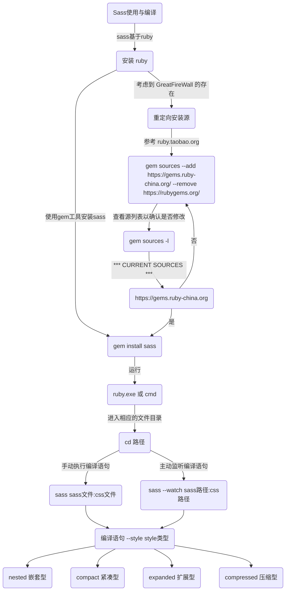
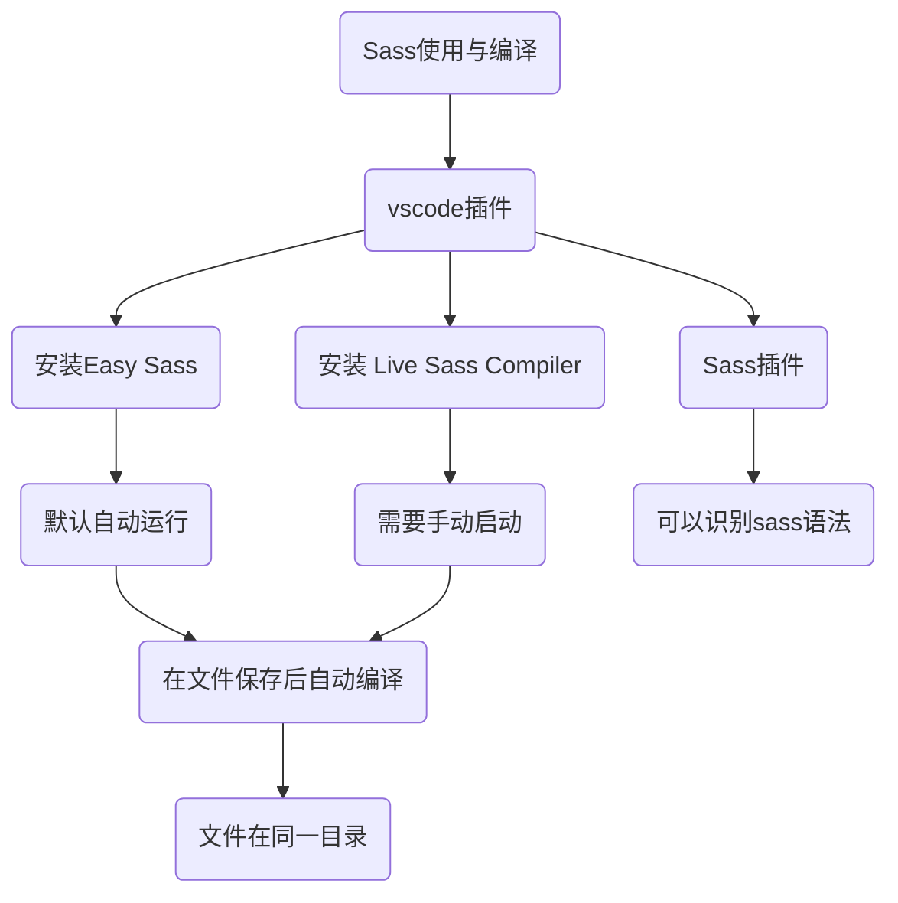

<!--
 * @Author: Jackie.Wang
 * @LastEditors: JackieWang
 * @Description: file content
 * @Date: 2019-03-14 15:00:15
 * @LastEditTime: 2019-03-14 17:03:33
 -->
# Sass

> Sass is the most mature, stable, and powerful professional grade CSS extension language in the world.

在sass中, 提供了变量, 运算, 函数, 嵌套等写法, 相较于一般css写法会有更强的可读性, 也更方便后期维护

### 安装与使用
#### 基于Ruby

sass是基于ruby而开发的, 所以需要安装ruby环境, 然后使用 gem工具install sass

ruby官网



亦或使用VSCode插件进行编译使用

#### VSCode 插件

###### Sass编译插件


###### Sass语法高亮插件




### 变量
```scss
/** 0-0 关于变量
* 使用场景
* 当一个 值(数值/字符串/列表等) 会被用到至少两次, 且后续更新维护时会有修改需求
*/
$baseColor: #333; // 变量以 $ 开头
$base-fontSize: 12px; // 变量可以使用 -
$fontSize-24: 24px; // 变量可以使用 数字
$base-border: 1px solid #333;

// 变量值可以是 颜色 / 数字 / 字符串 / 数列等
#box-0-0 {
  display: none;
  border: $base-border;
}

#box-0-0 p {
  color: $baseColor;
  font-size: $base_fontSize; // sass 并不区分 - 与 _
}

#box-0-0 a {
  font-size: $fontSize-24;
  border: $base-border;
}
```
### 运算
```scss
/** 0-1 运算
* 数学运算 / 颜色计算 / 连字符 / 插值
* + - * /
* + 可以运算, 也可以是连字符, / 运算时, 需要 () 包住
*/

#box-0-1 {
  display: none;

  .box {
    .demo {
      // 关于除法的相关运算
      $width: 1000px;
      font: 10px/8px; // 纯 CSS，不是除法运算
      width: $width/2; // 使用了变量，是除法运算
      width: round(1.5) / 2; // 使用了函数，是除法运算
      height: (500px/2); // 使用了圆括号，是除法运算
      margin-left: 5px + 8px/2px; // 使用了加（+）号，是除法运算
    }

    .left,
    .right {
      width: calc(50% - 2px);
      width: calc(50%-2rem);
      /** css3 运算函数, 可以将 % 转成 px 后再运算 */
      height: 100px;
      float: left;
      border: 1px solid $baseColor;
    }

    .left {
      background-color: skyblue - #333;
    }

    .right {
      background-color: yellowgreen;
    }
  }
}
```
### 嵌套
#### 层级嵌套
```scss
/** 1 关于嵌套
/** 1-0 层级嵌套
* 不建议嵌套过深, 因为编译后的选择器过长会影响样式的权重, 也会影响浏览器效能
* 类比于js的事件冒泡, 浏览器在处理css选择器时会从右向左一步步解析
*/
#box-1-0 {
  display: none;
  background-color: yellowgreen;

  p {
    color: $baseColor;
    font-size: $base-fontSize;

    a {
      color: #fff;
      text-decoration: none;
    }
  }
}
```
#### 选择器
```scss
/** 1-1 选择器
* 后代 (' ')空格 换行 / 子代 ( > ) / 后一个兄弟 ( + ) / 所有兄弟 ( ~ )
*/
#box-1-1 {
  display: none;

  p a {
    font-size: 12px;
    background-color: skyblue;
  }

  p > a {
    font-size: 16px;
    // background-color: yellowgreen;
  }

  p ~ a {
    font-size: 24px;
    background-color: #ccc;
  }

  p + a {
    font-size: 20px;
    background-color: pink;
  }
}
```
#### 父级选择器
```scss
/** 1-2 父选择器
* &
*/
#box-1-2 {
  display: none;

  .main {
    a {
      color: $baseColor;

      &:hover {
        color: #fff;
        background-color: $baseColor;
      }
    }

    &-content {
      background-color: skyblue;
    }
  }
}
```
#### 属性嵌套
```scss
/** 1-3 属性嵌套 */
#box-1-3 {
  display: none;

  p {
    font: {
      family: '宋体';
      size: 20px;
      weight: 800;
    }
  }

  a {
    padding: 0 10px;

    border: 1px solid #333 {
      top: 0;
      bottom: 0;
    }
  }
}
```
### 文件混入
```scss
/** 2 文件混入 @import 'url'
* 在文件编译过程中会将相关的文件直接写入文档引入位置, 且不一定要将引入语句写在顶部
* 区别于 css 自带的 @import, 在浏览器加载时会发起请求, 且必须写在最顶部
*
* 适用于模块化开发, 将每个模块的样式文件单独开发, 最后一起引入,
* 在最终项目仅需要在 html 中引入一个编译后的 css 样式表即可
*/
#box-2 {
  display: none;
  @import 'demo';
  // 一般外部的scss文件(完成一些特定样式功能), 称之为 局部样式文件
  // 局部文件一般使用 _ 开头
  // 在引入的时候不需要写后缀, 也不需要写 _
  // @import 在哪就解析在哪
}
```
### 混合
#### 一般混合
```scss
/** 3 混合 @mixin(){}
/** 3-0 一般混合
*/
#box-3-0 {
  display: none;

  @mixin warning {
    color: #fff;
    background-color: #d44;
    font-weight: 800;
    font-size: 16px;
  }

  button {
    @include warning;
  }
}
```
#### 带参混合
```scss
/** 3-1 带参混合 */
#box-3-1 {
  display: none;

  @mixin fn1($color, $bgColor, $fontSize) {
    color: $color;
    background-color: $bgColor;
    font-weight: 800;
    font-size: $fontSize;
  }

  p {
    @include fn1(#333, skyblue, 24px);
  }

  button {
    @include fn1(#fff, #d44, 18px);
  }
}
```
#### 带默认值混合
```scss
/** 3-2 带 默认值 传值 */
#box-3-2 {
  display: none;

  @mixin fn2($color: #333, $bgColor: skyblue, $fontSize: 24px) {
    color: $color;
    background-color: $bgColor;
    font-weight: 800;
    font-size: $fontSize;
  }

  p {
    @include fn2(#fff, #d44, 18px);
  }

  button {
    @include fn2();
    // @include fn1(#fff,#d44,18px); 存在 域
  }
}
```
#### 插值
```scss
/** 3-3 插值 */
#box-3-3 {
  display: none;

  @mixin fn2($name, $value) {
    -webkit-#{$name}: $value;
    -safari-#{$name}: $value;
    -ie-#{$name}: $value;
    -o-#{$name}: $value;
    #{$name}: $value;
  }

  p {
    @include fn2(box-shadow, (0 0 10px 10px skyblue));
  }

  button {
    @include fn2('box-shadow', 0 0 10px 10px #d44);
  }
}
```
#### 一般复杂用法
```scss
/** 3-4 一般复杂用法 */
#box-3-4 {
  display: none;

  @mixin demo($num) {
    @for $i from 1 through $num {
      .demo#{$i} {
        background-color: darken(skyblue, $i * 8);
        width: $i * 30px;
        height: $i * 30px;
      }
    }
  }

  @include demo(6);
}
```
### 继承
#### 类继承
```scss
/** 4 继承 @extend
/** 4-0 类继承 .class
* 相比于 混合(不会将混合的样式类进行合并), 会将类进行合并输出
*/
#box-4-0 {
  display: none;

  .danger {
    background-color: #f33;
    color: #fff;
    font-weight: 800;
    font-size: 16px;

    a {
      margin-left: 20px;
      text-decoration: none;
    }

    &:hover {
      background-color: skyblue;
      color: #333;
    }
  }

  .btn1 {
    @extend .danger;
  }

  .demo1 {
    @extend .danger;
  }

  // 隐藏 bug 因为 .danger 本身也是页面元素之一, 会被各种调用, 继承会 copy 所有 样式
  // div .danger{
  //   background-color: #fff;
  // }
}
```
#### 占位符继承
```scss
/** 4-1 占位符继承 %placeholder */
#box-4-1 {
  display: none;

  %danger {
    background-color: #f33;
    color: #fff;
    font-weight: 800;
    font-size: 16px;

    a {
      margin-left: 20px;
      text-decoration: none;
    }

    &:hover {
      background-color: skyblue;
      color: #333;
    }
  }

  .btn1 {
    @extend %danger;
  }

  .demo1 {
    @extend %danger;
  }
}
```
### 函数
#### 数字函数
```scss
/** 5 函数 */
/** 5-0 数字函数
* percentage($value)：将不带单位的数转换成百分比值；
* round($value)：将数值四舍五入，转换成一个最接近的整数；
* ceil($value)：向上取整；
* floor($value)：向下取整；
* abs($value)：取数的绝对值；
* min($numbers…)：找出几个数值之间的最小值；
* max($numbers…)：找出几个数值之间的最大值；
* random(): 获取随机数
*/
#box-5-0 {
  display: none;
  margin-right: 0 auto;
  width: 800px;
  height: 100px;
  background-color: #eee;

  .demo {
    background-color: yellowgreen;
  }

  .demo1 {
    width: percentage(0.2); //转换成百分比值
    height: percentage(120px / 40px);
    margin: percentage(5em / 100em);
  }

  .demo2 {
    width: round(123.4px); //四舍五入，两边单位不统一会报错
    height: round(120px / 2);
    margin: round(12.2%);
  }

  .demo3 {
    width: ceil(123.4px); //向上取整
    height: ceil(300px / 7);
    margin: ceil(12.2%);
  }

  .demo4 {
    width: floor(123.4px); //向下取整
    height: floor(300px / 7);
    margin: floor(12.2%);
  }

  .demo5 {
    width: abs(123.4px); //绝对值
    height: min(15%, 30, 300%); //找出最小值
    margin: max(10px, 50px); //找出最大值
    padding: random() * 10; //随机数
  }
}
```
#### RGB颜色函数
```scss
/** 5-1 RGB颜色函数
* rgb($r, $g, $b) / rgba($r, $g, $b, $a)
* red($color) / green($color) / blue($color)
* mix($color1, $color2, $percent)
*/
#box-5-1 {
  display: none;
  $color1: yellowgreen;
  $color2: rgba(red($color1), green($color1), blue($color1), 0.65);

  .demo {
    float: left;
    width: 100px;
    height: 100px;
    margin: 10px;
    text-align: center;
    line-height: 100px;
  }

  .demo1 {
    background-color: $color1;
  }

  .demo2 {
    background-color: $color2;
  }

  .demo3 {
    background-color: mix($color1, #f44);
  }

  .demo4 {
    background-color: mix($color1, #f44, 25%);
  }

  .demo5 {
    background-color: mix($color1, #f44, 50%);
  }

  .demo6 {
    background-color: mix($color1, #f44, 75%);
  }
}
```
#### HSL颜色函数
```scss
/** 5-2 HSL颜色函数
* hsl() / hsla()
* hue() / saturation() / $lightness()
* adjust-hue($color,$degrees)：通过改变一个颜色的色相值；
* lighten($color,$amount)：通过改变颜色的亮度值，让颜色变亮；
* darken($color,$amount)：通过改变颜色的亮度值，让颜色变暗；
* saturate($color,$amount)：通过改变颜色的饱和度值，让颜色更饱和;
* desaturate($color,$amount)：通过改变颜色的饱和度值，让颜色更少的饱和;
* grayscale($color)：将一个颜色变成灰色，相当于desaturate($color,100%);
* complement($color)：返回一个补充色，相当于adjust-hue($color,180deg);
* invert($color)：反回一个反相色，红、绿、蓝色值倒过来，而透明度不变。
*/
#box-5-2 {
  display: none;
  margin: 0 auto;
  width: 1050px;
  //定义变量
  // $redBase: #DC143C;
  $redBase: #f00;
  $orangeBase: saturate(lighten(adjust_hue($redBase, 39), 5), 7); //#f37a16
  $yellowBase: saturate(lighten(adjust_hue($redBase, 64), 6), 13); //#fbdc14
  $greenBase: desaturate(darken(adjust_hue($redBase, 102), 2), 11); //#73c620
  $blueBase: saturate(darken(adjust_hue($redBase, 201), 2), 1); //#12b7d4
  $purpleBase: saturate(darken(adjust_hue($redBase, 296), 2), 1); //#a012d4
  $blackBase: #777;
  $bgc: #fff;

  // $orangeBase: orange;
  // $yellowBase: yellow;
  // $greenBase: #73c620;
  // $blueBase: blue;
  // $purpleBase: #a012d4;
  // $blackBase: #777;
  //定义颜色变暗的mixin
  @mixin swatchesDarken($color) {
    @for $i from 1 through 10 {
      $x: $i + 11;

      li:nth-child(#{$x}) {
        $n: $i * 5;
        $bgc: darken($color, $n); //颜色变暗
        background-color: $bgc;

        &:hover:before {
          //hover状态显示颜色编号
          content: '#{$bgc}';
          color: lighten($bgc, 40);
          font-family: verdana;
          font-size: 8px;
          padding: 2px;
        }
      }
    }
  }

  //定义颜色变亮的mixin
  @mixin swatchesLighten($color) {
    @for $i from 1 through 10 {
      $x: 11-$i;

      li:nth-child(#{$x}) {
        $n: $i * 5;
        $bgc: lighten($color, $n);
        background-color: $bgc;

        &:hover:before {
          content: '#{$bgc}';
          color: darken($bgc, 40);
          font-family: verdana;
          font-size: 8px;
          padding: 2px;
        }
      }
    }
  }

  .demo li {
    width: (100% / 21);
    float: left;
    height: 60px;
    list-style: none outside none;
  }

  ul.demo1 {
    @include swatchesLighten($redBase);
    @include swatchesDarken($redBase);

    li:nth-child(11) {
      background-color: $redBase;
    }
  }

  ul.demo2 {
    @include swatchesLighten($orangeBase);
    @include swatchesDarken($orangeBase);

    li:nth-child(11) {
      background-color: $orangeBase;
    }
  }

  ul.demo3 {
    @include swatchesLighten($yellowBase);
    @include swatchesDarken($yellowBase);

    li:nth-child(11) {
      background-color: $yellowBase;
    }
  }

  ul.demo4 {
    @include swatchesLighten($greenBase);
    @include swatchesDarken($greenBase);

    li:nth-child(11) {
      background-color: $greenBase;
    }
  }

  ul.demo5 {
    @include swatchesLighten($blueBase);
    @include swatchesDarken($blueBase);

    li:nth-child(11) {
      background-color: $blueBase;
    }
  }

  ul.demo6 {
    @include swatchesLighten($purpleBase);
    @include swatchesDarken($purpleBase);

    li:nth-child(11) {
      background-color: $purpleBase;
    }
  }

  ul.demo7 {
    @include swatchesLighten($blackBase);
    @include swatchesDarken($blackBase);

    li:nth-child(11) {
      background-color: $blackBase;
    }
  }
}
```
### 资料补充
**sass官网 [https://www.sass-lang.com](https://www.sass-lang.com)**
**ruby官网 [http://www.ruby-lang.org/zh_cn/](http://www.ruby-lang.org/zh_cn/)**
**函数补充 [https://www.w3cplus.com/preprocessor/sass-color-function.html](https://www.w3cplus.com/preprocessor/sass-color-function.html)**
